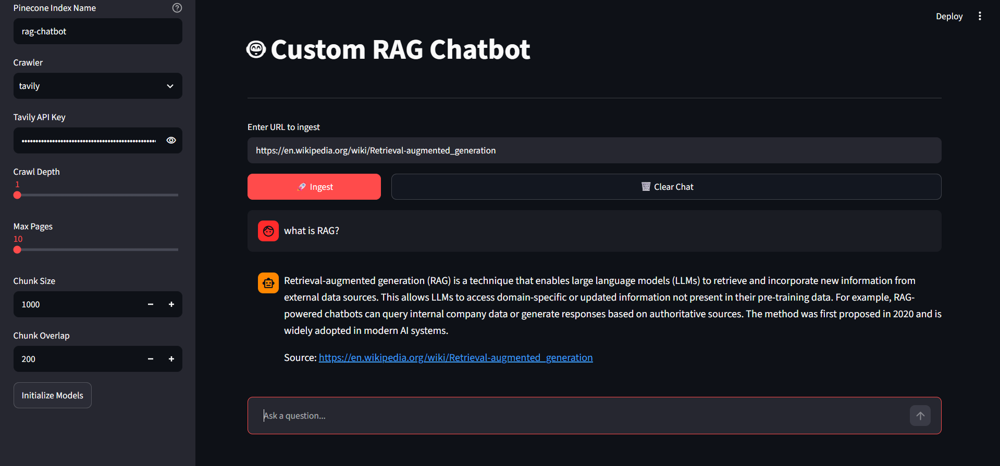
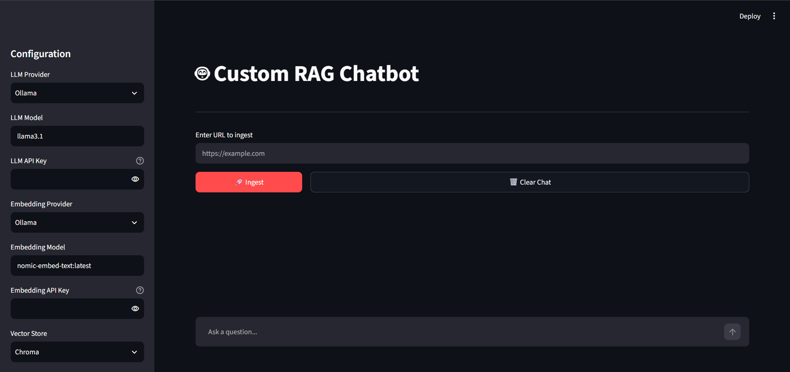
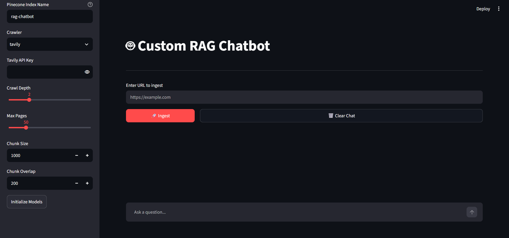

# Custom RAG Chatbot

**English** | [فارسی](#فارسی-persian)

A Streamlit app that crawls a website, indexes it into a vector store, and answers questions about it with streaming responses and source links. The LLM, embedding model, vector store, and crawler are all swappable from the sidebar, so you can compare local and hosted setups on the same content.



*Ingested the Wikipedia article on retrieval-augmented generation (crawl depth 1, 10 pages max), then asked "what is RAG?". The answer streams in with a link to the source page.*

## What it does

1. **Crawl** a URL with Tavily or Firecrawl, with configurable depth and page limit
2. **Chunk** the pages with a recursive character splitter (size and overlap adjustable)
3. **Embed** the chunks with Ollama or OpenAI
4. **Index** them in Chroma (local) or Pinecone (hosted)
5. **Retrieve** the top-k chunks for each question and **generate** an answer with Ollama, OpenAI, or Anthropic, streamed token by token, with the source URL attached

```
┌─────────────┐     ┌─────────────┐     ┌─────────────┐     ┌─────────────┐
│   Crawl     │────▶│   Chunk     │────▶│   Embed     │────▶│   Index     │
│ (Tavily/    │     │ (Recursive  │     │ (Ollama/    │     │ (Chroma/    │
│  Firecrawl) │     │  Character) │     │  OpenAI)    │     │  Pinecone)  │
└─────────────┘     └─────────────┘     └─────────────┘     └─────────────┘
                                                                      │
┌─────────────┐     ┌─────────────┐     ┌─────────────┐              │
│  Generate   │◀────│  Retrieve   │◀────│   Query     │──────────────┘
│ (Streaming) │     │  (Top-k)    │     │  Embedding  │
└─────────────┘     └─────────────┘     └─────────────┘
```

## Supported providers

| Component | Options |
|-----------|---------|
| LLM | Ollama (local), OpenAI, Anthropic |
| Embeddings | Ollama (local), OpenAI |
| Vector store | Chroma (local, persisted to `chroma_db/`), Pinecone |
| Crawler | Tavily (search-based), Firecrawl (full-site) |

## Getting started

### Prerequisites

- Python 3.10+
- [Ollama](https://ollama.com) if you want to run models locally
- API keys only for the providers you choose to use

### Install

```bash
git clone https://github.com/bardia-geeked/Custom-RAG-Chatbot.git
cd custom-rag
python -m venv .venv
source .venv/bin/activate  # Windows: .venv\Scripts\activate
pip install -r requirements.txt
```

### Fully local setup (no API keys except a crawler key)

The default sidebar settings use Ollama for both the LLM and embeddings, with Chroma as the vector store:

```bash
ollama pull llama3.1
ollama pull nomic-embed-text
```

You still need a Tavily or Firecrawl key for crawling.

### Run

```bash
streamlit run main.py
```

Open http://localhost:8501.

## Usage

There is no `.env` file. All API keys are entered in the sidebar at runtime.

1. **Pick providers** in the sidebar: LLM provider and model, embedding provider and model, and vector store. Paste the matching API keys where needed. For Pinecone, also enter the index name.

   

2. **Set crawl and chunking options**: crawler, crawl depth, max pages, chunk size, and chunk overlap. Then click **Initialize Models**.

   

3. **Ingest a site**: paste a URL and click **Ingest**.
4. **Ask questions** in the chat box at the bottom. Use **Clear Chat** to reset the conversation.

## Design notes

**Provider factories.** `src/core.py` exposes factory functions (`get_llm`, and equivalents for embeddings and vector stores) so `main.py` never imports a specific provider. Adding a provider means adding one branch to a factory rather than touching the UI or pipeline code.

```python
def get_llm(provider: str, model: str, **kwargs) -> BaseChatModel:
    if provider == "Ollama": return ChatOllama(...)
    if provider == "OpenAI": return ChatOpenAI(...)
    if provider == "Anthropic": return ChatAnthropic(...)
```

**Async ingestion.** Crawling is network-bound, so the pipeline in `ingestion.py` is async and indexes in batches instead of one chunk at a time.

```python
async def ingest_url(url, crawler, config, chunker_config, embedder, vectorstore):
    docs = await _crawl(url, crawler, config)
    chunks = _chunk(docs, chunker_config)
    await _index(chunks, embedder, vectorstore)
```

**Streaming with sources.** The answer is streamed with `llm.astream` and rendered via `st.write_stream`. The retrieved documents are stored alongside each assistant message so the source link stays attached to its answer.

**Switching embedding models means re-indexing.** Different embedding models produce vectors of different dimensions, so an existing Chroma collection or Pinecone index can't be reused after changing the embedding provider or model. Ingest again into a fresh collection or index (for example, `nomic-embed-text` outputs 768 dimensions and OpenAI's `text-embedding-3-small` outputs 1536).

**Chroma vs. Pinecone.** Chroma needs no account and persists to disk, which makes it the right default for local experiments. Pinecone is there for hosted, shared use, at the cost of an account, an index to create with the right dimension, and network latency per query.

**Chunking defaults.** The defaults (1000 characters, 200 overlap) are a starting point, not a tuned result. Chunk size trades off precision (small chunks match specific questions) against context (large chunks keep surrounding explanation intact), so it's exposed in the UI to experiment with per site.

<!--
TODO: add results once you've run them. Suggested format:

## Evaluation

Hand-written set of N question/answer pairs over <site>. Metric: hit rate@k
(the chunk containing the answer appears in the top-k results).

| Chunk size | Overlap | Hit rate@4 |
|------------|---------|------------|
| 500        | 100     | ...        |
| 1000       | 200     | ...        |
| 1500       | 300     | ...        |
-->

## Project structure

```
custom-rag/
├── main.py             # Streamlit UI and orchestration
├── ingestion.py        # Crawl → chunk → embed → index pipeline
├── src/
│   └── core.py         # Provider factories (LLM, embeddings, vector store)
├── requirements.txt
├── docs/screenshots/   # Images used in this README
└── chroma_db/          # Local vector store (gitignored)
```

## Limitations

- Retrieval is vector-only. There is no hybrid (BM25 + vector) search and no reranking, so keyword-heavy questions can miss.
- No automated evaluation yet, so chunking and retrieval settings are judged by eye.
- Re-ingesting the same URL may add duplicate chunks rather than replacing the old ones.
- Chat history lives in Streamlit session state and is lost on page refresh.
- Crawl quality depends on the crawler service. Tavily and Firecrawl handle JavaScript-heavy or paywalled pages differently, and both are metered APIs.
- Anthropic is available for generation only; it does not provide an embedding model.

## فارسی (Persian)

<div dir="rtl">

### چت‌بات RAG سفارشی

این پروژه یک اپلیکیشن Streamlit برای ساخت یک چت‌بات RAG از روی محتوای یک وب‌سایت است. برنامه ابتدا سایت را crawl می‌کند، محتوای آن را به بخش‌های کوچک‌تر تقسیم می‌کند و در یک vector store ذخیره می‌کند. بعد از آن می‌توانید درباره‌ی محتوای سایت سؤال بپرسید و پاسخ را همراه با لینک منبع دریافت کنید.

یکی از بخش‌های اصلی پروژه این است که می‌توانید مدل زبانی، مدل embedding، vector store و ابزار crawl را از داخل نوار کناری تغییر دهید. در نتیجه می‌توانید مثلاً یک setup کاملاً لوکال را با یک setup مبتنی بر API، روی یک محتوای یکسان مقایسه کنید.

### پروژه چطور کار می‌کند؟

1. **Crawl:** آدرس سایت را با استفاده از Tavily یا Firecrawl دریافت می‌کند و بر اساس عمق و تعداد صفحات تعیین‌شده، محتوای سایت را جمع‌آوری می‌کند.
2. **Chunk:** صفحات دریافت‌شده را با یک recursive character splitter به بخش‌های کوچک‌تر تقسیم می‌کند. اندازه‌ی chunk و میزان overlap قابل تنظیم است.
3. **Embed:** هر chunk را با Ollama یا OpenAI به یک embedding vector تبدیل می‌کند.
4. **Index:** embeddingها را در Chroma (محلی) یا Pinecone (ابری) ذخیره می‌کند.
5. **Retrieve & Generate:** هنگام پرسیدن سؤال، نزدیک‌ترین chunkها را پیدا می‌کند و آن‌ها را در اختیار مدل زبانی قرار می‌دهد تا پاسخ را به‌صورت streaming تولید کند. لینک منبع مربوط به هر پاسخ هم نمایش داده می‌شود.

### سرویس‌ها و مدل‌های قابل استفاده

| بخش             | گزینه‌ها                         |
| --------------- | -------------------------------- |
| مدل زبانی (LLM) | Ollama (محلی)، OpenAI، Anthropic |
| Embedding       | Ollama (محلی)، OpenAI            |
| Vector Store    | Chroma (محلی)، Pinecone (ابری)   |
| Crawler         | Tavily، Firecrawl                |

### شروع کار

#### پیش‌نیازها

* Python نسخه‌ی 3.10 یا بالاتر
* اگر می‌خواهید مدل‌ها را به‌صورت محلی اجرا کنید، Ollama
* API Key سرویس‌هایی که انتخاب می‌کنید

#### نصب

</div>

```bash
git clone https://github.com/bardia-geeked/Custom-RAG-Chatbot.git
cd custom-rag
python -m venv .venv
source .venv/bin/activate  # Windows: .venv\Scripts\activate
pip install -r requirements.txt
```

<div dir="rtl">

### اجرای کاملاً لوکال

اگر برای LLM و embedding از Ollama و برای vector store از Chroma استفاده کنید، برای این بخش‌ها به API Key نیازی ندارید.

برای شروع، مدل‌های موردنظر را با Ollama دریافت کنید:

</div>

```bash
ollama pull llama3.1
ollama pull nomic-embed-text
```

<div dir="rtl">

برای crawl کردن سایت همچنان به API Key مربوط به Tavily یا Firecrawl نیاز دارید.

### اجرای برنامه

</div>

```bash
streamlit run main.py
```

<div dir="rtl">

بعد از اجرای برنامه، آدرس زیر را در مرورگر باز کنید:

`http://localhost:8501`

### نحوه‌ی استفاده

فایل `.env` در این پروژه استفاده نمی‌شود و API Keyها مستقیماً هنگام اجرای برنامه، از طریق نوار کناری وارد می‌شوند.

1. **انتخاب سرویس‌ها:** ابتدا LLM و مدل آن، مدل embedding و vector store موردنظر را انتخاب کنید. سپس API Keyهای لازم را وارد کنید. اگر Pinecone را انتخاب کرده‌اید، نام index را هم وارد کنید.
2. **تنظیم crawl و chunking:** crawler، عمق crawl، حداکثر تعداد صفحات، اندازه‌ی chunk و میزان overlap را مشخص کنید و روی **Initialize Models** بزنید.
3. **وارد کردن سایت:** URL موردنظر را وارد کنید و روی **Ingest** بزنید تا محتوای سایت پردازش و ایندکس شود.
4. **پرسیدن سؤال:** بعد از تمام شدن ingest، می‌توانید سؤال خود را در کادر چت پایین صفحه وارد کنید. با **Clear Chat** هم می‌توانید تاریخچه‌ی گفت‌وگو را پاک کنید.

### چند نکته درباره‌ی طراحی پروژه

* **Provider Factory:** در `src/core.py` برای LLM، embedding و vector store از factory function استفاده شده است. بنابراین `main.py` مستقیماً به یک سرویس خاص وابسته نیست. برای اضافه کردن یک provider جدید، کافی است منطق مربوط به آن را در factory اضافه کنید و نیازی به تغییر UI یا pipeline اصلی نیست.
* **Async Ingestion:** از آنجا که crawl کردن بیشتر به شبکه وابسته است، بخش ingestion به‌صورت async نوشته شده و chunkها نیز به‌صورت batch پردازش می‌شوند.
* **Streaming و نمایش منبع:** پاسخ مدل با `llm.astream` به‌صورت streaming دریافت و با `st.write_stream` نمایش داده می‌شود. اسناد بازیابی‌شده نیز همراه پیام ذخیره می‌شوند تا منبع هر پاسخ در دسترس باشد.
* **تغییر مدل embedding:** اگر مدل embedding را عوض کنید، باید داده‌ها را دوباره index کنید. دلیلش این است که مدل‌های مختلف می‌توانند vectorهایی با ابعاد متفاوت تولید کنند. برای مثال، `nomic-embed-text` بردارهای ۷۶۸بعدی و `text-embedding-3-small` بردارهای ۱۵۳۶بعدی تولید می‌کنند.
* **Chroma یا Pinecone؟** Chroma برای آزمایش‌های لوکال گزینه‌ی ساده‌ای است و داده‌ها را روی دیسک نگه می‌دارد. Pinecone بیشتر برای استفاده‌ی ابری و اشتراکی مناسب است، اما به account و index جداگانه نیاز دارد و درخواست‌ها هم از طریق شبکه ارسال می‌شوند.
* **تنظیم chunk size:** مقدارهای پیش‌فرض `1000` برای اندازه‌ی chunk و `200` برای overlap فقط یک نقطه‌ی شروع هستند. chunkهای کوچک‌تر معمولاً برای پیدا کردن اطلاعات دقیق مناسب‌ترند، در حالی که chunkهای بزرگ‌تر بخش بیشتری از متن و context اطراف آن را حفظ می‌کنند. به همین دلیل این دو مقدار در UI قابل تغییر هستند.

### محدودیت‌های فعلی

* در حال حاضر retrieval فقط بر اساس similarity برداری انجام می‌شود و hybrid search (مثل BM25 + vector search) یا reranking وجود ندارد. در نتیجه بعضی سؤال‌هایی که به keywordهای مشخص وابسته‌اند ممکن است نتیجه‌ی خوبی نداشته باشند.
* هنوز سیستم ارزیابی خودکار برای سنجش کیفیت retrieval وجود ندارد و تنظیمات chunking و retrieval بیشتر با بررسی نتایج انجام می‌شوند.
* اگر یک URL را دوباره ingest کنید، ممکن است chunkهای تکراری به جای داده‌های قبلی اضافه شوند.
* تاریخچه‌ی چت در Streamlit session state نگه داشته می‌شود و با refresh کردن صفحه از بین می‌رود.
* کیفیت crawl به سرویسی که انتخاب می‌کنید بستگی دارد. Tavily و Firecrawl در برخورد با سایت‌های JavaScript-heavy یا صفحات دارای paywall عملکرد متفاوتی دارند و استفاده از هر دو سرویس شامل محدودیت API است.
* Anthropic در این پروژه فقط برای تولید پاسخ استفاده می‌شود و embedding model ارائه نمی‌دهد.

</div>
